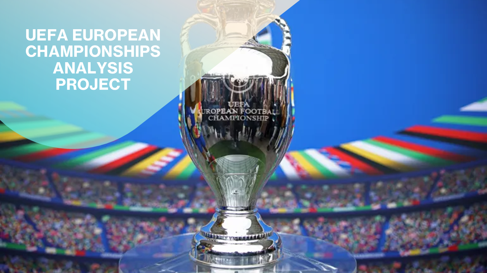
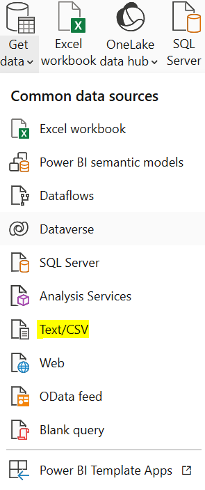
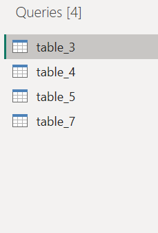
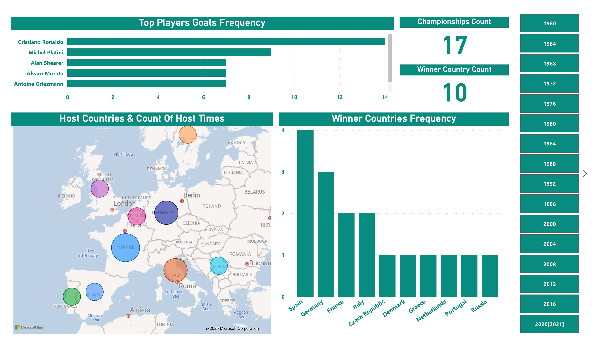
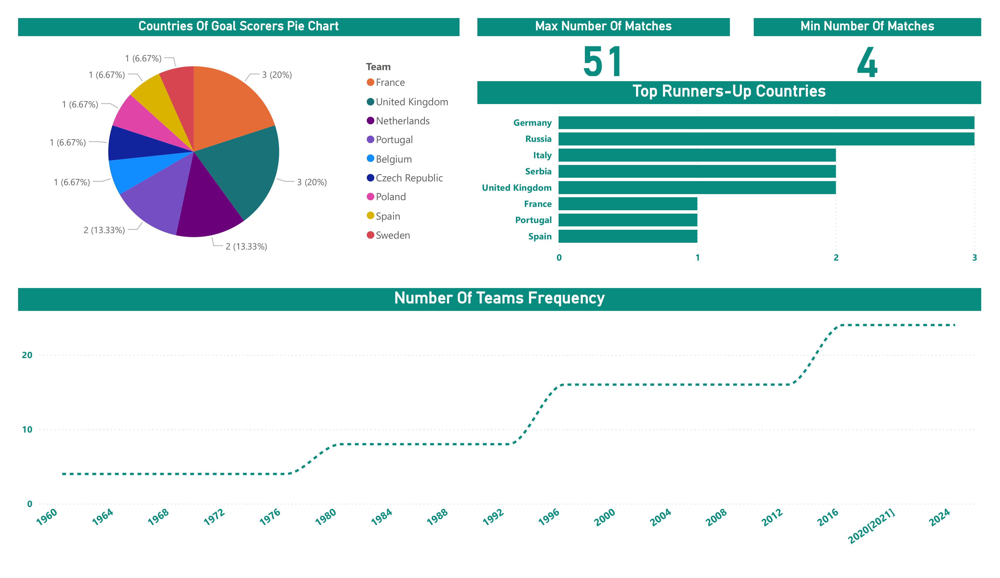

# **UEFA European Championships Analysis Project**


## **1. Introduction:**
This project analyzes the UEFA European Championships, providing insights into the trends, performances, and key moments that have defined one of the most prestigious football tournaments in the world. Using Python, data on the championships, spanning from 1960 to 2024, will be extracted from reliable sources such as official UEFA databases or Wikipedia. This data, encompassing match results, team performances, player statistics, and tournament outcomes, will then be loaded into Power BI Desktop. Within Power BI, the Extract, Transform, Load (ETL) process will be employed to clean, prepare, and structure the data, creating a robust foundation for analysis and reporting. The resulting visualizations will offer a comprehensive overview of the tournament's history, highlighting key performance indicators, team dominance, and emerging patterns within this dynamic and highly competitive football landscape.

You can see the full Dashboards from [here](Power_BI_Dashboards).

## **2. Tools I Used:**

**1. Python:** for extract the tables of the dataset from the Wikipedia website on a CSV files.

**2. Power BI Desktop:** for Extract, Transform, Load (ETL) process and create interactive dashboards.

**3. Git & GitHub:** for sharing my analysis and dashboard.

## **3. Extract Tables From Web _Wikipedia_ (UEFA European Championship):**
- Using Python Pandas library to extract tables from the Wikipedia website from link: https://en.wikipedia.org/wiki/UEFA_European_Championship

- Python code extracted a 27 CSV files. I deleted 23 not important and not meaning tabls, and extract the reming 4 tables to Power BI for ETL (Extract - Transform - Load) process.

```py
import pandas as pd

url = "https://en.wikipedia.org/wiki/UEFA_European_Championship"

tables = pd.read_html(url)

print(f"The Number Of Tables = {len(tables)}")

for index, table in enumerate(tables):
    print(f"Saving Table_{index + 1}")
    file_name = f"table_{index + 1}.csv"
    table.to_csv(
        file_name,
        index=False,
        header=True
    )
```
## **4. Upload Extracted Tables To Power BI Desktop:**

**4.1. Get data from Power BI using Text/CSV:**



**4.2. Transform tables Into power query for cleaning and preparing structure the data:**



## **5. Claening & Preparing The Data In Power Query:**

**5.1. First table (table_3.csv) Cleaning (Transform):**
- Naming the first table **(Championships_System_Details)**.
- Remove **top (1) row**.
- Use first row as **headers**.
- Change the names of the columns to **(Year / No_Teams / Min_No_Matches / Actual_No_Matches / Championship_System)**.
- Delete rows of years **(2028  2032)**, as they have not occurred yet 2025, **remove bottom (2) rows**.
- Replace **(,)** values in column **(Championship_System)** with **(>)** to clear the systems for every year.
- Change the data type of column **(Year)** to text to use it more as **categorical column**.
- Replace value in column **(Year) 2020** to **2020[2021]**, to clear show that the UEFA European Championships (EURO) 2020 was originally scheduled to take place from June 12 to July 12, 2020, but, due to the coronavirus (COVID19) pandemic, it was decided on March 17, 2020 that the tournament would be postponed by one year to be held from June 11 to **July 11, 2021**.

**5.2. Second Table (table_4.csv):**
- Naming the second table **(Championships_Finals)**.
- Remove top **(2)** row.
- Use first row as **headers**.
- Delete rows of years **(2028  2032)**, as they have not occurred yet 2025, remove bottom (2) rows.
- Remove columns **(3, 7, 11)**, as they 100% contain **null** values.
- Remove **duplicated rows (2 columns ro 1980 championship)**.
- Change the names of the columns to **(Host : Country(s)_Host / Score : Final_Score / Thied place : Third_Place / Score_1 : Third_Fourth_Place_Score / Fourth place : Fourth_Place / Number of teams : Number_Of_Teams)**.
- Delete columns from **(Third_Place) to (Fourth_Place)**, as they confused and not clear which country acive the third place and fourth place, also we don’t need them in analysis.
- Replace value in column (Year) **2020[c] to 2020[2021]**, to clear show that the UEFA European Championships (EURO) 2020 was originally scheduled to take place from June 12 to July 12, 2020, but, due to the coronavirus (COVID19) pandemic, it was decided on March 17, 2020 that the tournament would be postponed by one year to be held from June 11 to **July 11, 2021**.
- Replace the values of **(West Germany)** in column (Country_Host) to only **Germany**.
- Replace values of space in two countries host to **(&)** using replace value using special characters.
- Replace value in column (Country_Host) **Europe[d]** to **Europe[11 Countries]**, to clear show that the UEFA European Championship 2020 was held across 11 different host countries. Here is a list of the countries that hosted the tournament:
    1.	Azerbaijan
    2.	Denmark
    3.	England
    4.	Germany
    5.	Hungary
    6.	Italy
    7.	Netherlands
    8.	Romania
    9.	Russia
    10.	Scotland
    11.	Spain
- Replace values of **(Soviet Union) in column (Winners) to (Russia) , (West Germany) to (Germany), (Yugoslavia) to (Serbia), (Czechoslovakia) to (Czech Republic), and (England) to (United Kingdom)**.
- Replace values of **(Soviet Union) in column (Runnersup) to (Russia), (West Germany) to (Germany), (Yugoslavia) to (Serbia), (Czechoslovakia) to (Czech Republic), and (England) to (United Kingdom)**.

**5.3. Third Table (table_5.csv):**
- Naming the third table **(Team_Performances)**.
- Use first row as **headers**.
- Change the names of the columns to **(Title(s) : Win_Count / Runnersup : Runners_up_Count /  Years won : Years_Won / Years runnerup : Years_Runner_Up)**.
- Replace **[b, c, d, e]** values from column (Team).
- Replace **[a]** value in column (Years_Won).
- Replace **[a]** value in column (Years_Runner_Up).
- Replace values of **()** from columns **(Win_Count / Runners_up_Count  / Years_Won / Years_Runner_Up)** to avoid error when converting the data type of columns from text to whole number.
- Convert the data type of columns **(Win_Count / Runners_up_Count)** from **text** to **whole number**.

**5.4. Foruth Table (table_7.csv):**
- Naming the third table **(Top_Goalscorers)**.
- Remove columns **(Notes)**.
- Change the names of the columns to **(Goals scored : Goals_Scored / Matches played : Matches_Played / Ratio : Score_Ratio)**.
- Replace value **(‡)** tin column **(Player)**.
- Replace values **{() – T – []}** from column **(Tournaments)**.
- Replace country **(England)** to **(United Kingdom)** in team column.


## **6. Create Measures For Analysis & Visualization:**
**6.1. Create Measure (Championships_Count) In Championships_System_Details table:**

```ml
Championships_Count = COUNT(Championships_System_Details[Year])
```
**6.2. Create Measure (Max_Number_Of_Matches) In Championships_System_Details table:**
```ml
Max_Number_Of_Matches = MAX(Championships_System_Details[Actual_No_Matches])
```
**6.3. Create Measure (Min_Number_Of_Matches) In Championships_System_Details table:**
```ml
Min_Number_Of_Matches = MIN(Championships_System_Details[Actual_No_Matches])
```
**6.4. Create Measure (Winner_Country_Count) In Team_Performances table:**
```ml
Winner_Country_Count = DISTINCTCOUNT(Championships_Finals[Winners])
```
## **7. Dashboards:**
**7.1. First Dashboard:**



**7.2. Second Dashboard:**



## **8. Analysis:**
- **Germany** and **Spain** are the most successful nations, each winning the tournament 3 times. This reflects their consistent performance and strong football traditions.

- **The frequency** of winners is distributed among **several** nations, indicating a **competitive** and **diverse** tournament history.

- **Countries** like **France, Germany, and Italy** have hosted the tournament multiple times, showcasing their infrastructure and organizational capabilities.

- **Germany and Spain** are the most successful nations, with multiple tournament wins and consistent performances.

- **Cristiano Ronaldo** leads with **17** goals, followed by **Michel Platini** and **Alan Shearer**. This highlights the dominance of these players in the tournament's history.

- **France, Portugal, and Spain** have the highest number of goalscorers, reflecting their strong attacking prowess.

- **Germany, Spain, and Italy** are the most frequent runnersup, indicating their consistent performance in reaching the final.

- **The frequency of teams** participating in the tournament has **increased over the years**, reflecting the expansion of the tournament and the growing popularity of football.